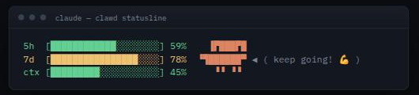

# clawd-statusline

A Claude Code status line I put together in an afternoon because I wanted my usage bars visible at a glance, and then thought "what if there was also a little guy." The little guy is clawd — Claude Code's actual mascot.



Three live bars (5-hour usage, 7-day usage, context window usage) and clawd chilling on the right. He's quiet most of the time, but every so often he strikes a pose and says something in a little speech bubble.

This is a fun side project, not a product — no roadmap, no promises, just a script that made my terminal more fun to look at.

## Install

```
curl -fsSL https://raw.githubusercontent.com/nghiatm-twendee/clawd-statusline/main/install.sh | bash
```

Grabs `statusline-command.sh`, drops it in `~/.claude/`, and adds a `statusLine` line to your `settings.json` without touching anything else already in there. Restart Claude Code (or start a fresh session) and it should show up.

Not into piping a random script into bash, understandably — [take a look at `install.sh`](./install.sh) first, or just do it yourself:

1. Copy [`statusline-command.sh`](./statusline-command.sh) to `~/.claude/statusline-command.sh`
2. Add this to `~/.claude/settings.json`:
   ```json
   "statusLine": {
     "type": "command",
     "command": "bash ~/.claude/statusline-command.sh"
   }
   ```

## Requirements

Just `bash` and `node` on your `PATH`. Node's only used for `node -e` to parse the JSON Claude Code hands it — no packages, nothing to install beyond having node around.

## Platform support

- **Linux** — yep, built and lived here the whole time.
- **macOS** — should just work. Hit one bash-version snag along the way (`$EPOCHSECONDS` needs bash 5+, macOS ships bash 3.2) and patched it with a `date` fallback.
- **Windows (native)** — needs Git Bash on your `PATH`, since Claude Code falls back to PowerShell without it and the script is bash. Haven't actually tried this one myself — if you do, let me know how it goes either way.
- **WSL** — same as Linux, no reason it wouldn't work.

## What's on it

- **`5h`** / **`7d`** — your Claude.ai rate-limit usage. Green under 50%, yellow under 80%, red past that.
- **`ctx`** — how full your context window is, live.
- **clawd** — sits next to the top two bars. About 1-in-6 refreshes he'll strike a random pose and pop up a short message for a few seconds before going back to quiet.

Bars show `n/a` until your first message of a session — that's normal, Claude Code just hasn't sent that data yet.

## Where clawd comes from

Not something I drew — clawd is Claude Code's real internal mascot. I pulled the actual pose data and actual color (`rgb(215,119,87)`) out of the installed CLI binary. Unofficial fan-recreation, not an Anthropic asset, not endorsed by anyone but me.

## How it works (the fun nerdy bits)

If you're curious how any of this actually works, here's the stuff I found interesting while building it.

**No timer, just events.** Claude Code reruns the script as a brand-new process whenever something happens — a new message, `/compact`, that sort of thing — not on a clock. No daemon, no loop, never touches the model (doesn't burn any tokens). It just gets one JSON blob on stdin and whatever gets printed becomes the status line.

**clawd's not invented, he's excavated.** The pose art, the animation names (`jump`, `look`, `celebrate`, `skip`, `spin`), all of it came from `strings`-ing the Claude Code binary and grepping around. The real thing draws him with a handful of Unicode block/quadrant characters (`▛ ▟ ▜ ▝ ▘ ▗ ▄ █`) — enough of those stacked in a small grid and you get a tiny sprite with zero image support needed. Same trick here.

**Why 256-color, not truecolor.** First attempt used real 24-bit color for clawd and it broke — corrupted the render in one terminal. The docs only show basic ANSI colors in their examples for a reason, apparently. Dropped to the 256-color palette instead (closest match to the real RGB), which is old enough that basically nothing chokes on it.

**A genuinely annoying bug.** Adding the `ctx` bar as a 3rd line, one terminal kept clipping it — but only when it had clawd's characters on it, never plain text, never the same bar characters used on lines 1-2. Took isolating line count, color, and Unicode content one at a time to figure out it was specifically clawd's quadrant characters on the *last* line, nothing else. That's why `ctx` is a plain bar instead of clawd showing his legs there.

**Faking memory in something that has none.** Every refresh is a brand new process with zero memory of the last one, so "show the bubble for 5 seconds" can't be a `sleep`. Instead it writes an expiry time + the chosen message to a tiny file, and every future run just checks "has that expired yet?" before deciding whether to reroll. A one-line TTL cache, basically.

## Customizing

It's all in `statusline-command.sh`, nothing fancy:

- `BUBBLE_HOLD_SECONDS` — how long the bubble sticks around (default `5`)
- `MESSAGES=(...)` — the pool of things clawd says, add/remove whatever, emoji are fine
- `RANDOM % 6` — how often the bubble shows up (currently ~1-in-6); lower the number for more often
- `color_for_pct()` — the green/yellow/red cutoffs

## Uninstall

```
curl -fsSL https://raw.githubusercontent.com/nghiatm-twendee/clawd-statusline/main/uninstall.sh | bash
```

Pulls the `statusLine` line back out of `settings.json` (leaves everything else alone) and deletes the script + its little state file. Or just do that by hand if you'd rather.

## Versioning

Yes, really — even for a fun afternoon project. Releases follow [SemVer](https://semver.org/)
and are tracked in [`CHANGELOG.md`](./CHANGELOG.md); commits follow
[Conventional Commits](https://www.conventionalcommits.org/). The current version is
printed in a comment at the top of `statusline-command.sh`.

## License

[WTFPL](./LICENSE). Do whatever you want with it.
